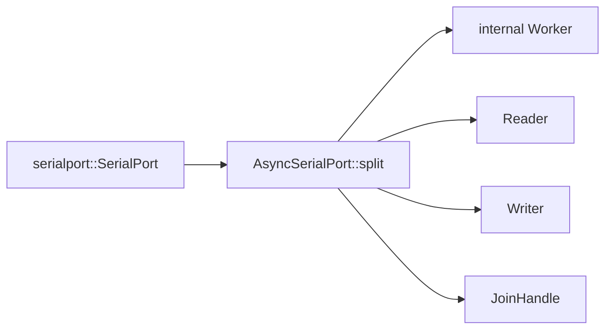
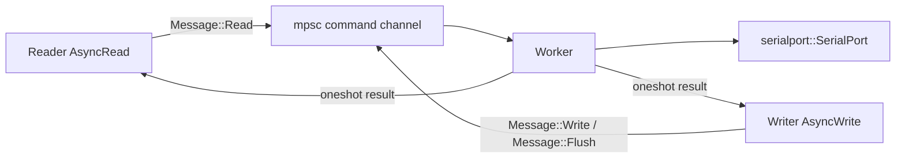

# Architecture

`async-serialport` separates the async API from the blocking serial-port API.
The async halves live in Tokio tasks, while a background worker owns the serial
port and executes the blocking operations.

## Components

- `Reader` implements `tokio::io::AsyncRead`.
- `Writer` implements `tokio::io::AsyncWrite`.
- `AsyncSerialPort` is the public extension trait that starts the worker.
- `Worker` is crate-internal, owns the serial port, and receives internal
  `Message` commands.
- `Message` defines the internal read, write, and flush protocol.

## Construction Flow

Callers call `AsyncSerialPort::split` on an opened serial port. The trait
implementation creates the internal worker, starts the background task, and
returns the async halves plus the worker task handle.

## Message Flow

Each request sent to the worker contains a one-shot response channel. The async
half stores both the command-send future and the response receiver until the
operation completes.

## Read Path

1. `Reader::poll_read` creates a zeroed `BytesMut` sized to the caller's
   remaining `ReadBuf` capacity.
2. `Reader` sends that buffer to the worker in `Message::Read`.
3. The worker checks the number of bytes available on the serial port.
4. The worker reads at most the smaller of the available byte count and the
   provided buffer length.
5. The worker truncates the `BytesMut` to the actual read count, freezes it, and
   returns it through the response channel.
6. If the returned `Bytes` is empty, `Reader` keeps the read pending and sends
   another read request instead of completing the caller's read.
7. Otherwise, `Reader` copies the returned bytes into the caller's `ReadBuf`.

## Write Path

1. `Writer::poll_write` copies the caller's buffer into `Bytes`.
2. The writer sends `Message::Write` to the worker.
3. The worker writes the full buffer to the serial port.
4. The writer returns the accepted byte count after the worker reports success.

Flush and shutdown use the same request/response structure with
`Message::Flush`.

## Failure Modes

If the worker command channel or a response channel closes while an operation is
pending, the async half reports `std::io::ErrorKind::BrokenPipe`. Serial-port
operation failures are forwarded as `std::io::Error` values.

The worker task itself returns the owned serial port after all command senders
are dropped. Failed response sends are ignored by the worker because they mean
the requesting async half no longer waits for the result.
