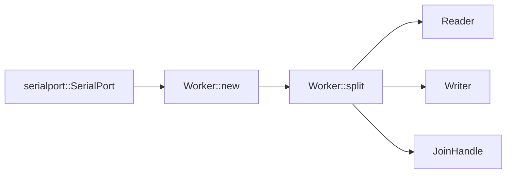
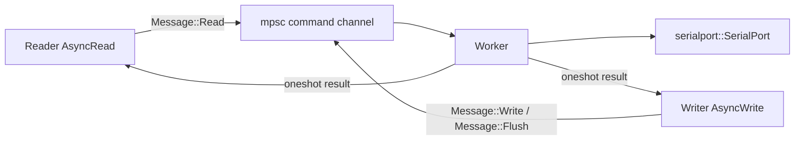

# Architecture

`async-serialport` separates the async API from the blocking serial-port API.
The async halves live in Tokio tasks, while a background worker owns the serial
port and executes the blocking operations.

## Components

- `Reader` implements `tokio::io::AsyncRead`.
- `Writer` implements `tokio::io::AsyncWrite`.
- `Worker` owns the serial port and receives internal `Message` commands.
- `Message` defines the internal read, write, and flush protocol.

## Construction Flow

Callers pass an opened serial port to `Worker::new`. Calling `Worker::split`
starts the background task and returns the async halves plus the worker task
handle.

## Message Flow

Each request sent to the worker contains a one-shot response channel. The async
half stores both the command-send future and the response receiver until the
operation completes.

## Read Path

1. `Reader::poll_read` sends `Message::Read` to the worker.
2. The worker checks the number of bytes available on the serial port.
3. If no bytes are available, the worker returns `ReadResponse::RetryLater`.
4. `Reader` treats `RetryLater` as a pending read and sends another read
   request instead of completing the caller's read.
5. When bytes are available, the worker reads them and returns a `Bytes` value.
6. `Reader` copies as many bytes as fit into the caller's `ReadBuf` and keeps
   any remaining bytes for later reads.

## Write Path

1. `Writer::poll_write` copies the caller's buffer into `Bytes`.
2. The writer sends `Message::Write` to the worker.
3. The worker writes the full buffer to the serial port.
4. The writer returns the accepted byte count after the worker reports success.

Flush and shutdown use the same request/response structure with
`Message::Flush`.

## Failure Modes

If the worker command channel or a response channel closes while an operation is
pending, the async half reports `std::io::ErrorKind::BrokenPipe`. Serial-port
operation failures are forwarded as `std::io::Error` values.

The worker task itself returns the owned serial port after all command senders
are dropped. Failed response sends are ignored by the worker because they mean
the requesting async half no longer waits for the result.
